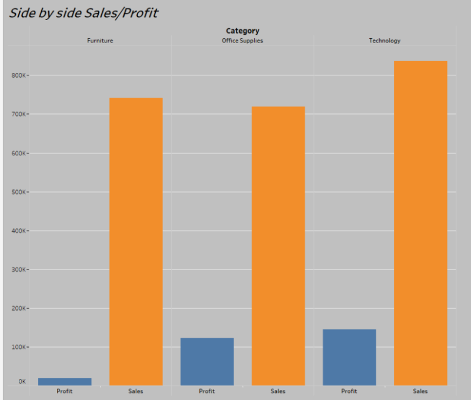

# Tableau-Project

## Project overview:
Exploring the Superstore Sales dataset using Tableau and created a dashboard to showcase key insights.  
Utilized various chart types including bar graphs, pie charts, and scatter plots to visually represent data   
and highlight trends. The dashboard provides a comprehensive overview of sales by region, product category,   
and shipping method, allowing for easy identification of top performers and opportunities for improvement.

## First Page
Created a bar chart to visualize the profit by product category and subcategory. Utilized a hierarchy  
to group subcategories under respective categories, resulting in a more organized and intuitive representation  
of data. The chart provides a clear picture of profit distribution across categories and subcategories,  
highlighting areas of success and potential for improvement.

## Second Page 
Created a side by side bar chart to compare Sales and Profit for each Category.

 

## Third Page 
To show the profit margin per category and subcategory,   
created a calculated field to derive the profit margin  
and used it to create a bar chart.

## Page four, five and six
I created a fourth chart to visualize the Profit Margin by Geography. This chart presents   
the data in a map view, with different colors representing the profit margins of each state.

Page 5: To better understand the overall performance of the Superstore, I created a table   
that displays key performance indicators (KPIs) such as Sales, Profit, Quantity, and Profit per Unit.

Page 6: To get a better understanding of the shipping methods used by the Superstore, I created  
a pie chart that shows the distribution of shipments across the different ship modes.

