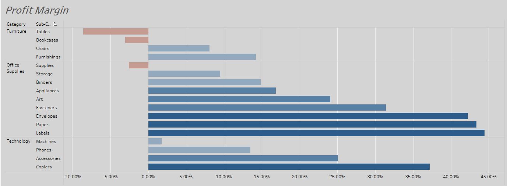
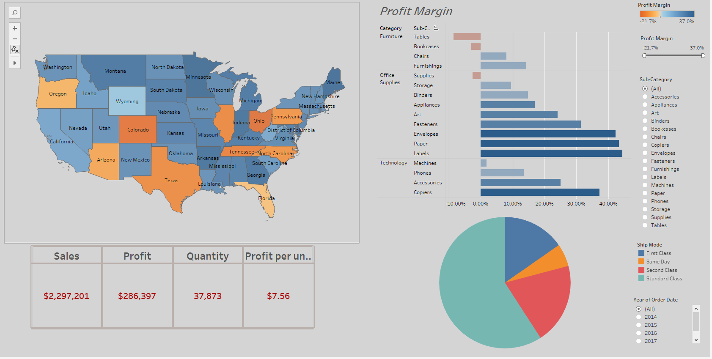

# Tableau-Project

## Project overview:
Exploring the Superstore Sales dataset using Tableau and created a dashboard to showcase key insights.  
Utilized various chart types including bar graphs, pie charts, and scatter plots to visually represent data   
and highlight trends. The dashboard provides a comprehensive overview of sales by region, product category,   
and shipping method, allowing for easy identification of top performers and opportunities for improvement.

## First Page
Created a bar chart to visualize the profit by product category and subcategory. Utilized a hierarchy  
to group subcategories under respective categories, resulting in a more organized and intuitive representation  
of data. The chart provides a clear picture of profit distribution across categories and subcategories,  
highlighting areas of success and potential for improvement.

## Second Page 
Created a side by side bar chart to compare Sales and Profit for each Category.

 

## Third Page 
To show the profit margin per category and subcategory,   
created a calculated field to derive the profit margin  
and used it to create a bar chart.

## Page four, five and six
I created a fourth chart to visualize the Profit Margin by Geography. This chart presents   
the data in a map view, with different colors representing the profit margins of each state.

Page 5: To better understand the overall performance of the Superstore, I created a table   
that displays key performance indicators (KPIs) such as Sales, Profit, Quantity, and Profit per Unit.

Page 6: To get a better understanding of the shipping methods used by the Superstore, I created  
a pie chart that shows the distribution of shipments across the different ship modes.

## Dashboard

I created a Tableau dashboard showcasing the sales performance of the Superstore. The dashboard comprises   
of four charts, including the map showing the profit margin by state, the bar chart displaying profit margin    
per category and subcategory, the table of key performance indicators, and the pie chart presenting  
the distribution of ship modes. To provide a comprehensive overview, I also included two legends and  
two filters that allow for further analysis, one for subcategories and another for the year of the order date.
Furthermore, the charts in the dashboard have been designed to work as filters, providing an interactive  
experience for the viewer and allowing for a deeper understanding of the data.

 

## Page  eight and nine

In addition to the previously mentioned charts, a scatterplot was created to show the relationship    
between sales and profit. To further enhance the analysis, a trend forecast was generated to predict  
sales per month based on historical data.

The final chart effectively showcases the upward trend in sales over time and highlights the recurring   
patterns present in the data. Upon analysis, it seems that every year September, November  
and December are the highest revenue months while January and February appear to be the lowest.

## **[Link](https://public.tableau.com/app/profile/dimitris.kaisaris4695/viz/Sales_Workbook1/Dashboard1)** for Tableau Public!

I have uploaded my project,  on Tableau public.  
Although only the dashboard is available for public viewing, I can provide the rest of my work upon request.  
Feel free to contact me! 

